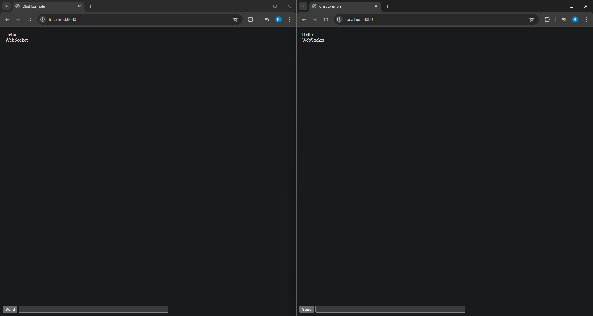
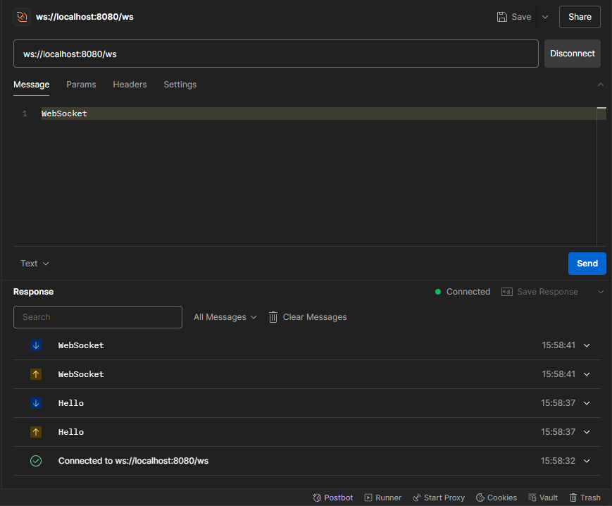

<div align="center">

# Go WebSocket

</div>

## Getting Started

### Prerequisites

- Go 1.22+
- Fiber v2

### Installation

1. Clone the repository:

   ```sh
   git clone https://github.com/Rachanonnn/go-fiber-websocket-practice
   cd go-fiber-websocket-practice
   ```

2. Install dependencies:
   ```sh
   go mod tidy
   ```

### Running the Application

Start the application using the following command:

```sh
go run .
```

Open http://localhost:8080 with your browser to see the result.

Can be test in Postman by create new WebSocket and connect to this path

```sh
ws://localhost:8080/ws
```

## Result




